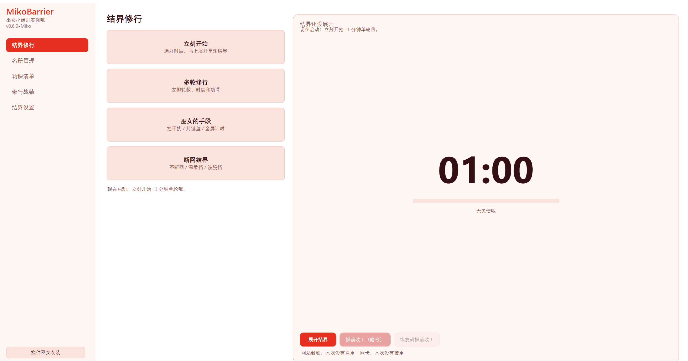
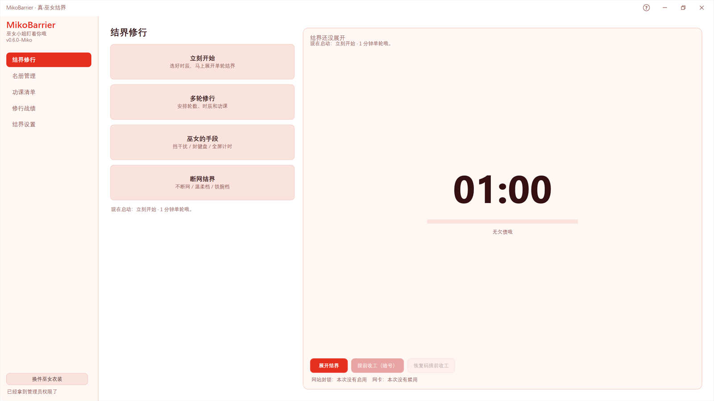
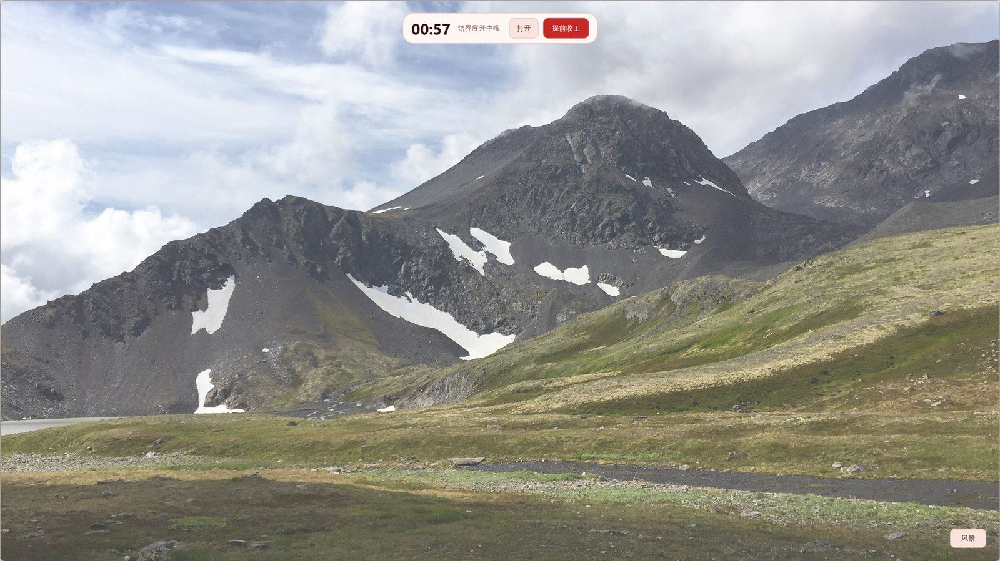
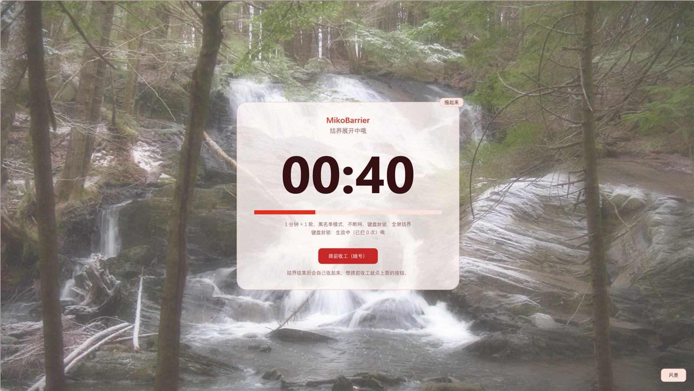
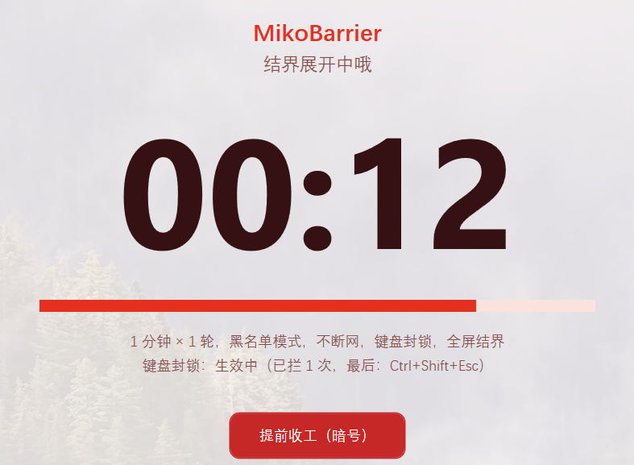
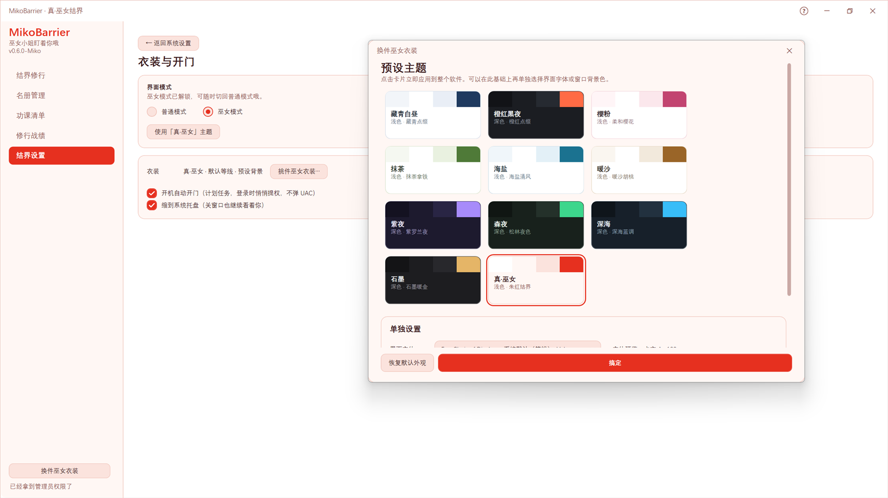
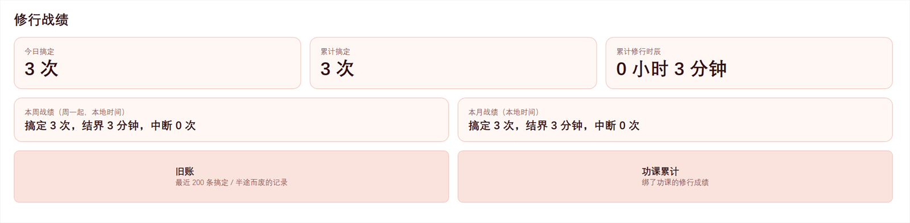

# MikoBarrier

> **A strict self-discipline / focus blocker for Windows.** While a session is running it kills the processes on your blacklist, blocks websites via the hosts file, optionally disables your network adapter, and swallows escape keys such as Alt+Tab, Alt+F4 and Ctrl+Shift+Esc. A two-process watchdog (App ↔ Guard) keeps it alive even if you try to kill it.
>
> It will **never** stop you from shutting down or logging off, and a recovery code can always end a session early — it locks out distractions, not you.

[](https://github.com/xgzshengming/MikoBarrier/actions/workflows/build.yml)
[](https://github.com/xgzshengming/MikoBarrier/releases/latest)
[](https://github.com/xgzshengming/MikoBarrier/releases)
[](LICENSE)
[](#requirements)

**[中文文档](README.md)** · [FAQ (Chinese)](docs/FAQ.md) · [Changelog](CHANGELOG.md) · [Gitee mirror](https://gitee.com/xgzshengming/miko-barrier)

> The application UI is currently Chinese-only. An English UI is on the roadmap — feel free to open an issue to vote for it.



## Quick start

**China: Quark netdisk (recommended, fast)**

- Link: <https://pan.quark.cn/s/37cdc61bc577>
- Access code: `MafQ`
- The folder contains the full zip as well as the two separate executables.

**Official source: GitHub Releases**

1. Download `MikoBarrier-<version>-win-x64.zip` from [Releases](https://github.com/xgzshengming/MikoBarrier/releases/latest).
2. Extract it anywhere (e.g. `D:\MikoBarrier`).
3. Run `MikoBarrier.App.exe`.

**Mirror:** [Gitee](https://gitee.com/xgzshengming/miko-barrier) (faster in mainland China; source is synced from GitHub).

All channels serve the same file. `SHA256` (zip): `2cfb772a56bdb38734e0cf9ff3be699b037d1881bd45a5660be8974d95431248`

You may also download the two executables directly: `MikoBarrier.App.exe` **and** `MikoBarrier.Guard.exe` must be kept **in the same folder**.

- Self-contained single-file build: **no .NET runtime installation required**.
- `MikoBarrier.Guard.exe` is the watchdog that patrols processes and keeps the app alive.
- Network blocking and global keyboard blocking require administrator rights (there is a one-click "restart as administrator" in settings).
- Builds are **not code-signed**: Windows SmartScreen may warn about an unknown publisher. Download only from Releases and verify `SHA256SUMS.txt`.
- Windows 10 / 11 (x64) only. Apache-2.0, no telemetry, all data stays on your machine.

## What makes it different from a Pomodoro timer

|  | Pomodoro apps | MikoBarrier |
| --- | --- | --- |
| Timer & rounds | ✅ | ✅ multi-round, per-round length, per-round tasks, session report |
| Kill distracting apps | ❌ | ✅ blacklist, or whitelist-only mode |
| Block the internet | ❌ | ✅ hosts file, or disable the network adapter |
| Block escape keys | ❌ | ✅ Alt+Tab / Alt+Esc / Ctrl+Esc / Alt+F4 / Ctrl+Shift+Esc (Win key is allowed) |
| Anti-kill | ❌ | ✅ heartbeat watchdog restarts the killed twin and records a "kill debt" |
| Anti-cheat | ❌ | ✅ early-exit debt, password cooldown, one recovery-code use per day, clock-rollback guard |
| Safe exit | anytime | Shutdown / logoff **always allowed**; password or recovery code ends a session |
| Privacy | often cloud-synced | no telemetry, no uploads, local data only |

## Features

- **Focus sessions** — presets (5 / 25 / 40 / 60 min) or custom 1–120 min, 1–12 rounds, optional 5/10 min breaks. Unfinished time becomes "debt" carried into your next session.
- **Tasks** — bind zero, one or several to-do items to each round; end-of-session report and per-task lifetime stats.
- **Blacklist / whitelist** — add running processes, browse for executables, or add a whole folder (Steam / game directories). Whitelist mode protects Windows system processes, input methods, GPU/audio panels and antivirus software, and follows child processes launched by a whitelisted app (up to 8 levels).
- **Network blocking** — "gentle": write blocked domains into the hosts file; "hard": hosts + disable the network adapter. Both are automatically restored after a crash or reboot.
- **Password & recovery** — 16-character master password (PBKDF2-SHA512), three security questions, and a recovery code stored as a DPAPI-encrypted local copy. Early exits trigger a 1h → 2h → rest-of-day cooldown; the recovery code can be used once per day.
- **Anti-bypass** — App ↔ Guard mutual watchdog (1 Hz heartbeat), progressive kill debt (5·n minutes, capped at 60/month), early-exit debt (capped at 120 min), crash snapshot recovery, clock-rollback detection.
- **Shutdown / logoff is always allowed** — the app writes a flag, restores the network, and never blocks Windows.
- **UI** — custom-drawn borderless WPF window, 10 light/dark themes plus a hidden "true miko" theme (white + vermilion), 10 CC0 background photos for the fullscreen timer, tray support, and a freely shareable stats card (900×1200 PNG).
- **Whitelist audit** — `--whitelist-audit` produces a read-only compatibility report you can run on any machine (`whitelist-audit.cmd`), useful for reporting false positives.

## Screenshots

| Main window (miko mode) | Fullscreen barrier |
| --- | --- |
|  |  |

| Barrier card | Mini timer bar |
| --- | --- |
|  |  |

| Themes | Stats |
| --- | --- |
|  |  |

## Build from source

Requires Windows 10/11 and the .NET 8 SDK or newer (a portable SDK installer is included).

```powershell
dotnet build .\MikoBarrier.sln -c Release -v minimal
dotnet run --project .\tools\SmokeTest\SmokeTest.csproj -c Release   # 185 core checks
powershell -ExecutionPolicy Bypass -File .\tools\publish.ps1         # self-contained build -> .\app\
```

Source layout: `src\MikoBarrier.App` (WPF UI), `src\MikoBarrier.Core` (engine, policy, patrol), `src\MikoBarrier.Guard` (watchdog), `tools\SmokeTest` (regression suite).

## Privacy

No telemetry, no network uploads. Password and security answers are stored as PBKDF2-SHA512 hashes; the recovery-code copy is encrypted with Windows DPAPI (CurrentUser). Runtime data lives under `%LocalAppData%\MikoBarrier` (or `D:\MikoBarrier` etc. if that folder already exists) and is excluded from git.

## Disclaimer

MikoBarrier is a tool for **restraining yourself**, not for parental control or employee monitoring. Use it only on a computer you own and administer, and only on yourself.

The software is provided "as is", without warranty of any kind. The author is not liable for any damage arising from its use, including but not limited to lost unsaved work, blocked applications, or modified network/system settings.

## License

[Apache License 2.0](LICENSE). Third-party notices: [NOTICE](NOTICE).

---

If MikoBarrier helps you, please consider giving it a ⭐ — it helps other people find it.
